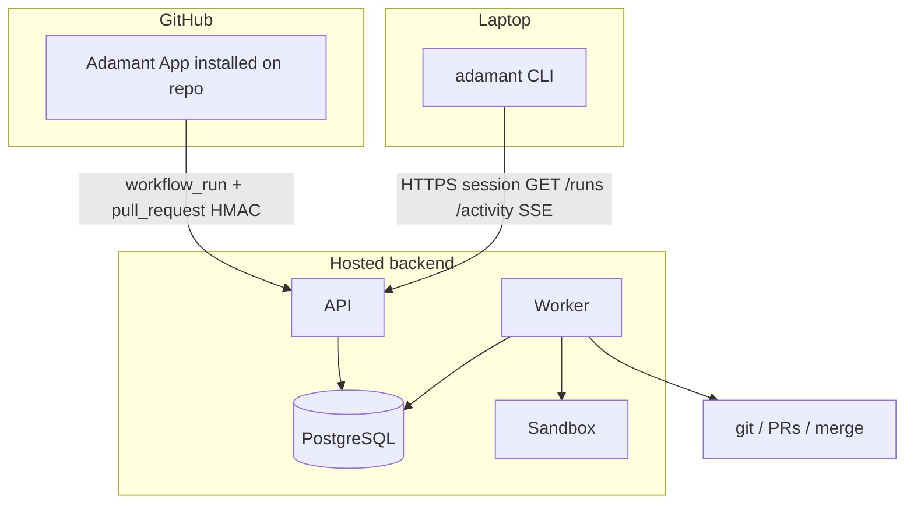
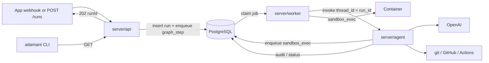
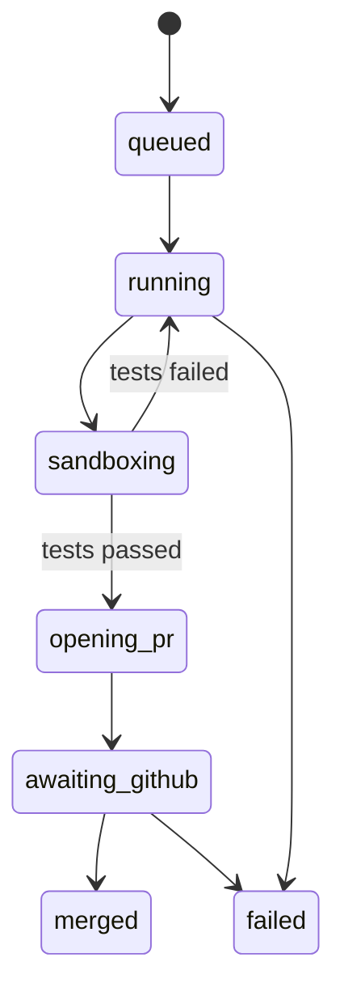
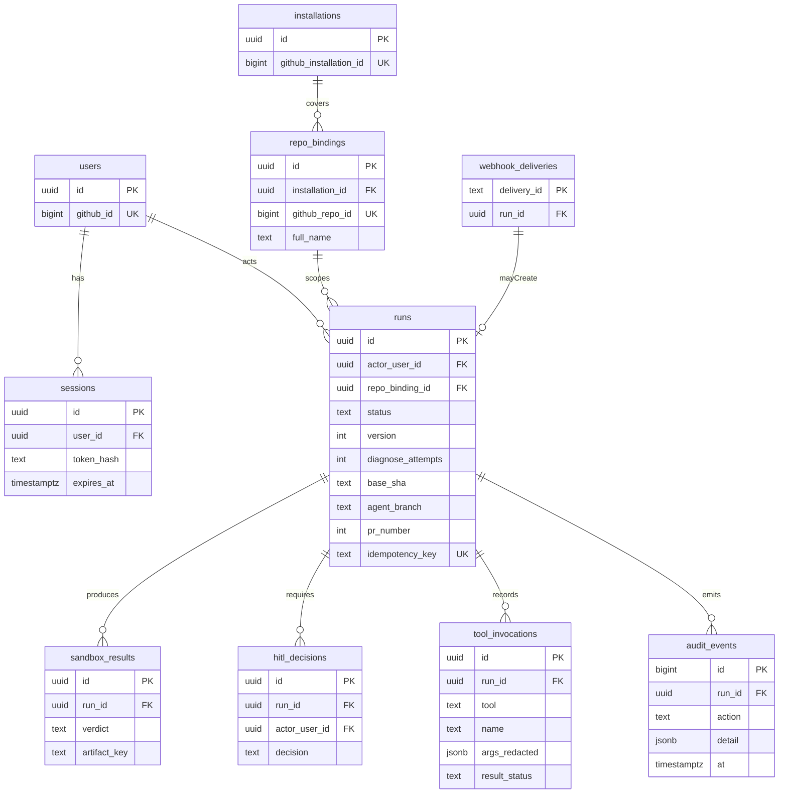

# Architecture

Adamant repairs a repo on a working branch, proves the change in a sealed
container, opens a pull request, and **merges that PR**. Phase 1 does not wait
for a human.

**Phase 1** is a hosted backend plus a CLI that stays connected to it.
Work list: [phase-1-tasks.md](phase-1-tasks.md). Tables: [database.md](database.md).



The API authenticates and ACKs. It does **not** run models or Docker. Workers
**import** `server/agent`. There is no `/agent` HTTP route.

## Phase 1 vs later

| Now                                                                       | Later                                                       |
| ------------------------------------------------------------------------- | ----------------------------------------------------------- |
| Hosted App + worker, CLI attached to that API, sandbox, merge our heal PR | Electron Heal, OAuth, HITL, agent-on-checkout, fingerprints |

Phase 1 auth: webhook HMAC. Seeded session (HTTPS) for the CLI and
`POST /runs`.

## Two surfaces

### GitHub App (plugin)

Installed on the eval repo. The **hosted** API and worker stay up. GitHub
sends webhooks to that origin. We do **not** poll. Compose on a laptop is
only for developing the backend.

| Event                          | We do                                                                                       |
| ------------------------------ | ------------------------------------------------------------------------------------------- |
| `workflow_run` failed          | Insert `queued` run, enqueue `graph_step`                                                   |
| `pull_request` closed + merged | If `pr_number` matches a run → `merged`. Else keep the delivery (`run_id` null) for the CLI |
| `ping` / `installation`        | Store delivery; upsert `installations` / `repo_bindings`                                    |

A merge never starts a heal. Red CI does.

Webhook URL: `https://<hosted>/webhooks/github`. Smee or ngrok only when
the API is not hosted yet.

### CLI (monitor)

`@adamant/cli` on the laptop, **always pointed at the hosted API**
(`ADAMANT_API_URL` + `ADAMANT_SESSION`). Read-only. It stays connected
(`watch` = SSE, reconnect on drop). Closing the CLI does not stop heals.

| Command            | Hosted API                                |
| ------------------ | ----------------------------------------- |
| `adamant status`   | `GET /health`                             |
| `adamant runs`     | `GET /runs`                               |
| `adamant run <id>` | `GET /runs/:id` (status + `audit_events`) |
| `adamant watch`    | `GET /activity` SSE                       |

No OpenAI key, no GitHub token, no merge from the CLI. The CLI must not
default to `localhost` except as an explicit override for backend
developers.

## Identity

Two principals. Do not mix their tokens.

| Principal               | Authenticates how                      | Purpose                               |
| ----------------------- | -------------------------------------- | ------------------------------------- |
| User                    | Seeded session now; GitHub OAuth later | CLI + `POST /runs`                    |
| GitHub App installation | HMAC + per-call installation token     | What the agent may do on a bound repo |

Installation tokens are minted per call. They are never stored in the CLI,
Electron, sessions, checkpoints, prompts, or the sandbox.

The worker sees `{ runId }` only. It trusts a `runs` row the API already
created.

## Auth (Phase 1)

| Route           | Auth                  | Does                                            |
| --------------- | --------------------- | ----------------------------------------------- |
| GitHub webhook  | `X-Hub-Signature-256` | Insert `webhook_deliveries`; maybe create a run |
| `POST /runs`    | Seeded session        | Start a run                                     |
| `GET /runs`     | Seeded session        | CLI list                                        |
| `GET /runs/:id` | Seeded session        | CLI detail                                      |
| `GET /activity` | Seeded session        | CLI watch (deliveries + audit, newest first)    |

Webhook: known `installation_id`, bind the repo, insert
`webhook_deliveries` **before** the run. Duplicate `delivery_id` → ACK, no
second run. Failed `workflow_run` → `queued` run + enqueue `graph_step`.
Use the seed user as `actor_user_id` until OAuth exists.

HITL (`POST /runs/:id/hitl`) is later. Phase 1 merges without it.

When you add Electron login later: PKCE in main, session secret in
`safeStorage`, Postgres stores `sessions.token_hash` only, renderer never
sees the secret. Then `POST /runs` also checks collaborator access (401 /
403 / 404).

## Workers

`graphile-worker` is the queue (no `jobs` table). The API inserts `runs`
(`queued`) and enqueues a task. The worker claims it and runs the graph
in-process.

| Task           | Process        | Does                                                   |
| -------------- | -------------- | ------------------------------------------------------ |
| `graph_step`   | Graph worker   | `import` `server/agent` and `invoke` the LangGraph     |
| `sandbox_exec` | Sandbox worker | Start the container; write `sandbox_results`; no model |

`server/agent` has no `listen()` and must not import Hono.



```ts
import { compileOpenAiHealGraph } from '../agent/index.ts'

await compileOpenAiHealGraph({ git, sandbox, recorder }, { checkpointer }).invoke(
  { runId, repository, baseSha },
  { configurable: { thread_id: runId } },
)
```

`thread_id = run_id`. `OPENAI_API_KEY` lives in the worker environment, never
on `runs`, in checkpoints, in the CLI, or in Electron.

Phase 1 does not `interrupt()` for a human. After a passing sandbox the
graph opens the PR and merges it. HITL `interrupt()` is later.

Worker death: lock TTL; resume the checkpoint. Do not start a second graph
for the same run.

## Agent tools

LangGraph calls **tools**, not raw `child_process` from the model. Every
call is allowlisted, logged on `audit_events`, and attributed to `run_id`.
Unknown commands fail closed.

### git (graph worker)

Per-run worktree. Credentials through a one-shot `GIT_ASKPASS`, then discarded.

Allowed: `fetch`, `checkout`, `switch -c`, `status`, `diff`, `log`, `show`,
`rev-parse`, `add`, `commit`, `push` (agent branch only).

Denied: push to the default branch, `push --force`, `reset --hard` of
protected refs, rebase onto default, credential helpers, untrusted
submodules.

The adapter sets the push refspec (`refs/heads/adamant/{run_id}`). The model
does not.

### GitHub API

Contents, compare, commits, issues, pull requests, review comments, check
runs, and **`merge_pull_request`** for this run only.

`merge_pull_request` is allowed only when all of these hold:

- latest `sandbox_results.verdict` is `pass`, read back from the table, not
  from graph state
- the run's `pr_publications` row is set and matches the PR being merged
- the PR head is `refs/heads/adamant/{run_id}` on the bound repo
- squash merge (or the repo's one allowed method) — not a merge of some
  other branch

Denied: merging any other PR, delete default branch, admin/ruleset edits,
token minting, anything outside the bound `repo_id`. The model does not
pick the PR number; the adapter reads it from the run.

### GitHub Actions

Read and wait. Do not treat Actions as the sandbox.

| Tool                             | Use                                     |
| -------------------------------- | --------------------------------------- |
| `list_workflow_runs`             | CI on the agent branch / PR             |
| `get_workflow_run` / jobs / logs | Diagnose a red build                    |
| `rerun_failed_jobs`              | After a patch (later; Phase 1 can skip) |
| `workflow_dispatch`              | Only workflows tagged `adamant-allowed` |

### git in the sandbox

Detached worktree, remotes and credentials stripped. May `diff` / `log`.
Cannot `push`, `fetch`, or see `GIT_ASKPASS`.

## Run state



Phase 1: `sandboxing` → `opening_pr` (no `awaiting_hitl`). The worker
calls `merge_pull_request`, then writes `merged`. `pull_request.closed`
may confirm the same status; it must not merge a second time.

`awaiting_hitl` stays in the enum for later. A merge without a passing
`sandbox_results` row is rejected.

## Graph

Commit locally. Sandbox. Push the agent branch **once**, after a pass, open
the PR, merge it.

```mermaid
flowchart TD
  retrieve[Clone and inspect] --> diagnose[Diagnose including Actions logs]
  diagnose --> plan[Plan]
  plan --> patch[Commit locally]
  patch --> sandbox[Sandbox]
  sandbox --> diagnose: fail retries left
  sandbox --> openPr[Push adamant/run_id and open PR]
  openPr --> mergePr[Merge that PR]
```

`diagnose_attempts` is capped on the run.

## Data

Enums, columns, migrations: [database.md](database.md). There is no `jobs`
table.



- Queue: graphile-worker (`graph_step` / `sandbox_exec`, payload `{ runId }`)
- Checkpoints: LangGraph library tables, `thread_id = run_id`
- `runs.idempotency_key`: `webhook:{delivery_id}` or client `Idempotency-Key`
- Redact tool args before persist (no tokens)

## Heal path

```mermaid
sequenceDiagram
  participant Gh as GitHub
  participant Api as API
  participant Pg as Postgres
  participant Graph as Graph worker
  participant Box as Sandbox

  Gh ->> Api: workflow_run failed HMAC
  Api ->> Pg: delivery + queued run + job
  Api -->> Gh: 202
  Graph ->> Pg: claim
  Graph ->> Gh: checkout SHA, fetch logs
  Graph ->> Graph: commit locally
  Graph ->> Box: sandbox_exec
  Box -->> Pg: verdict
  Graph ->> Gh: push adamant/run_id, open PR, merge it
  Gh ->> Api: pull_request merged HMAC
  Api ->> Pg: run merged + activity
```

`POST /runs` is the same after the 202. `adamant watch` reads `/activity`.

## Sandbox

Host clones, strips remotes and credentials, then starts the container.

- network off during tests (registry allowlist only for install)
- no `docker.sock`, dropped caps, memory / CPU / PID / time limits
- one container per job, destroyed on exit
- logs go to the artifact store; `verdict` is `pass` or `fail`

## Failure

| Case                       | What happens                                   |
| -------------------------- | ---------------------------------------------- |
| Duplicate webhook          | `delivery_id` PK, ACK, no second run           |
| Worker death               | lock TTL; resume checkpoint                    |
| git / API 403              | fail the run; do not retry from the sandbox    |
| Actions timeout            | treat as fail evidence; sandbox still required |
| Merge without sandbox pass | denied; run stays unmerged                     |
| Merge of a different PR    | denied; fail the run                           |
| Merged PR we did not open  | Store delivery; CLI shows it; no heal          |
| Bad webhook HMAC           | 401; no `webhook_deliveries` row               |
| No / expired session       | 401 on `POST /runs`                            |
| Session ok, no repo access | 403 (when OAuth exists)                        |

## Later

HITL before merge, Electron Heal, OAuth, agent-on-checkout, fingerprints,
`/adamant approve`.

## Ruleset

[`adamant-protocols.json`](../adamant-protocols.json) is active but
`conditions.ref_name.include` is empty, so it matches no branches. Set
include to `~DEFAULT_BRANCH` before relying on it for `main`.
